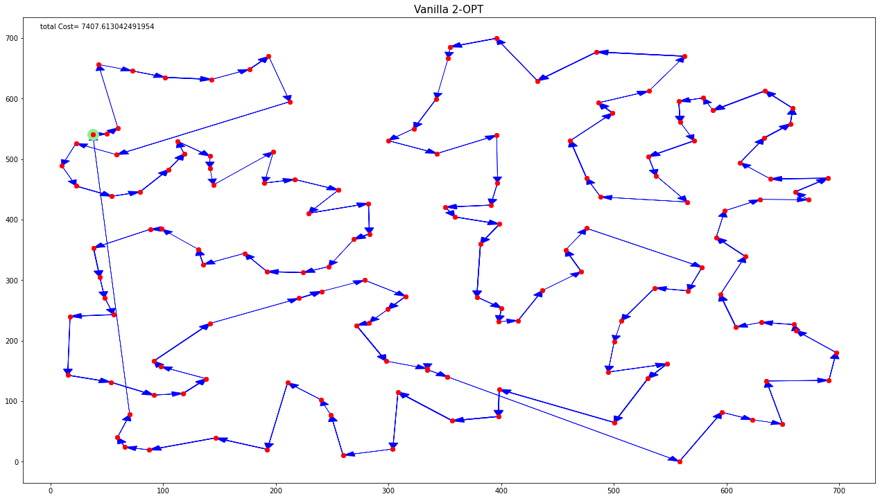
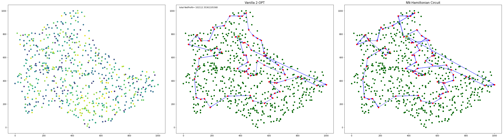

#  Captain Mich 
Modification for the Travelling Salesman Problem, written in Python, with Bin-packing and vertex cover problems.

---


---
# Contents

- [Introduction](#introduction)
- [Understanding the story](#getting-the-story)
- [Contributing](#contributing)
- [License](#license)

## Introduction

**Captain Mich** is an personal retell of the famous travelling salesman problem.
The story combines different other optimization problems like vertex cover and bin packing, the solution I got to implement uses different nature-inspired optimization algorithms, approximation algorithms, and greedy approaches.
The idea started from being a small task of mine, to become a project that is in progress to become more interactive, offers smarter solutions, and hopefully later to become an educational game like an open-world sandbox where players play the charcter of the pirate and start robbing the islands in a procedurally-generated 3D world with virtually infinite terrain, and may discover and extract raw materials(maximization constraints), craft tools and items(minimization constraints), and build structures or earthworks (fun tolerant constraints).

**Warning**
It is not even the 0.1 version, super buggy codes inside.
---

## Understanding the story
**Epsiode One**
Captin Mich is a renown pirate, nurturing a plan to rob several islands in the Carbian Sea(total of  islands). He knows how much money he can capture on each island(thanks to Panama Papers he has in the ship library),
as well as he knows the coordinates of all the islands(as there is a stolen cell phone with Google Maps in the pirate's possession). Captin Mich wants to visit some of the islands that are shown on the Google Maps,
starting from his homeisland and finishing his journey there as well. Captin Mich knows that sailing is not cheap:
to go some distance  by sea requires the amount of money that is numerically equal to .
During his voyage Captin Mich wants to get as much total profit as possible, so he would agree to not visiting any island if the cost of going there outweighs the money stored on that island, the only exception is the pirate's homeisland.
there is one important restriction: the total amount of money that Captin Mich captures on any  consecutive island must not exceed , or the captin would be overflowed with his pirates glory and would overdose rum, while celebrating the victories.


---
#### Dependencies

Checkout ```requirements.txt```


#### Running

Currently everything is just packed in a fun super buggy Jupyter notebook files.
**An honest promise to make it an alive clean package soon.**

## Contributing

A list of bugs and missing features can be found on the [issue tracker](https://github.com/alridha/captain-mich/issues/).
Feel free to work on any bug and submit a pull request to the `main` branch with the fix.
Mentioning that you intend to fix a bug on the issue will prevent other people from trying as well and makes sure no duplicated work is done.

### New features

I first and foremost try to fix broken buggy codes, then make the game feature complete compared to the vanilla jupyter notebook edition and except for very specific things these should be prioritized.

## License
MIT
